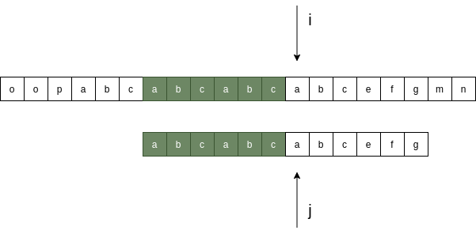
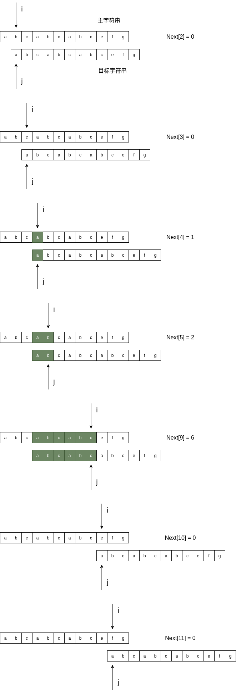

## Partial Match Table（PMT 部分匹配表）

#### 1. 字符串前缀集合/字符串后缀集合定义

如果字符串A和字符串B存在等价关系，``A = BX``，其中X是任意的``非空字符串``，那么称字符串B为字符串A的``前缀字符串``。例如，``"pattern"``的前缀字符串包括{"p", "pa", "pat", "patt", "patte", "patter"}，所有的前缀字符串组成的集合称为``前缀集合``。同理，如果字符串A和字符串B存在等价关系，``A = XB``，其中X是任意的``非空字符串``，那么称字符串B为字符串A的``后缀字符串``。例如，"match"的后缀字符串包括{"atch", "tch", "ch", "h"}，所有的后缀字符串组成的集合称为``后缀集合``。

#### 2. PMT定义

清楚了前缀集合和后缀集合定义，我们就可以引申出``Partial Match Table (PMT)``的概念。``PMT``本身是一个整型数组，数组长度和模式字符串的长度保持一致，数组的值由各个子串的前缀集合和后缀集合的交集中最长元素的长度决定。

#### 3. 以字符串"abcabcabcefg"为例

* 子串"ab"

```text
前缀集合 {a}

后缀集合 {b}

交集    { }

交集中最长元素长度为0
```

* 子串"abc"

```text
前缀集合 {a ab}

后缀集合 {bc c}

交集    { }

交集中最长元素长度为0
```

* 子串"abca"

```text
前缀集合 {a ab abc}

后缀集合 {bca ca a}

交集    {a}

交集中最长元素长度为1
```

* 子串"abcab"

```text
前缀集合 {a ab abc abca}

后缀集合 {bcab cab ab b}

交集    {ab}

交集中最长元素长度为2
```

* 子串"abcabc"

```text
前缀集合 {a ab abc abca abcab}

后缀集合 {bcabc cabc abc bc c}

交集    {abc}

交集中最长元素长度为3
```

* 子串"abcabca"

```text
前缀集合 {a ab abc abca abcab abcabc}

后缀集合 {bcabca cabca abca bca ca a}

交集    {a abca}

交集中最长元素长度为4
```

* 子串"abcabcab"

```text
前缀集合 {a ab abc abca abcab abcabc abcabca}

后缀集合 {bcabcab cabcab abcab bcab cab ab b}

交集    {ab abcab}

交集中最长元素长度为5
```

* 子串"abcabcabc"

```text
前缀集合 {a ab abc abca abcab abcabc abcabca abcabcab}

后缀集合 {bcabcabc cabcabc abcabc bcabc cabc abc bc c}

交集    {abc abcabc}

交集中最长元素长度为6
```

* 子串"abcabcabce"

```text
前缀集合 {a ab abc abca abcab abcabc abcabca abcabcab abcabcabc}

后缀集合 {bcabcabce cabcabce abcabce bcabce cabce abce bce ce e}

交集    { }

交集中最长元素长度为0
```

* 子串"abcabcabcef"

```text
前缀集合 {a ab abc abca abcab abcabc abcabca abcabcab abcabcabc abcabcabce}

后缀集合 {bcabcabcef cabcabcef abcabcef bcabcef cabcef abcef bcef cef ef f}

交集    { }

交集中最长元素长度为0
```

* 子串"abcabcabcefg"

```text
前缀集合 {a ab abc abca abcab abcabc abcabca abcabcab abcabcabc abcabcabce abcabcabcef}

后缀集合 {bcabcabcefg cabcabcefg abcabcefg bcabcefg cabcefg abcefg bcefg cefg efg fg g}

交集    { }

交集中最长元素长度为0
```

于是可得``PMT数组``如下表所示:

|string |   a	|   b	|   c	|   a	|   b	|   c	|   a	|   b	|   c	|   e	|   f	|   g	|
|---	|---	|---	|---	|---	|---	|---	|---	|---	|---	|---	|---	|---	|
|index  |   0	|   1	|   2	|   3	|   4	|   5	|   6	|   7	|   8	|   9	|   10	|   11	|
|PMT    |   0	|   0	|   0	|   1	|   2	|   3	|   4	|   5	|   6	|   0	|   0	|   0	|

## KMP (单模式匹配算法)

### 1. 利用PMT加速字符串匹配

上一节我们得到字符串``"abcabcabcefg"``对应的``PMT = {0 0 0 1 2 3 4 5 6 0 0 0}``，这一小节我们将展示如何利用这个``PMT数组``来加速模式字符串的匹配查找。

如图1所示，在``主字符串"oopabcabcabcabcefgmn"``中查找``模式字符串"abcabcabcefg"``，发现在``指针j``处发生字符失配，根据``PMT``的性质，主字符串中``指针i``之前的``PMT[j−1] = 6``位字符一定与模式字符串的前``PMT[j−1] = 6``位字符是匹配的（主字符串在``指针i``处失配，意味着主字符串的子串``s[i−j, i-1]``与模式字符串的子串``p[0, j-1]``是完全相同的，在本例中模式字符串的子串``p[0, j-1] = "abcabcabc"``，其前缀集合与后缀集合的交集的最长元素为``"abcabc"``，长度为``6``）。


这样一来，我们就可以省略掉一部分子串的比较。如图2所示，保持``指针i``不动，将``指针j``指向模式字符串的第``PMT[j−1] = 6``位，即模式字符串指针回溯了``j - PMT[j−1] = 3``位。



我们看到如果是在第``j``位失配，那么影响``指针j``回溯位置的其实是``PMT[j - 1]``的值。实践中，我们一般不直接使用``PMT数组``，而是将``PMT数组``中的各个元素向右偏移一位，我们将得到的新数组称为``Next数组``。注意，在把``PMT数组``向右偏移时，第``0``位的值，我们将其设为``-1``，这只是为了编程上的便利。

在本例中，可得``Next数组``如下表所示:

|string |   a	|   b	|   c	|   a	|   b	|   c	|   a	|   b	|   c	|   e	|   f	|   g	|
|---	|---	|---	|---	|---	|---	|---	|---	|---	|---	|---	|---	|---	|
|index  |   0	|   1	|   2	|   3	|   4	|   5	|   6	|   7	|   8	|   9	|   10	|   11	|
|PMT    |   0	|   0	|   0	|   1	|   2	|   3	|   4	|   5	|   6	|   0	|   0	|   0	|
|Next   |   -1	|   0	|   0	|   0	|   1	|   2	|   3	|   4	|   5	|   6	|   0	|   0	|

### 2. KMP算法程序示意

```C
int kmp(const char * s, const char * p)
{
    int i = 0, j = 0;
    int s_len = strlen(s);
    int p_len = strlen(p);

    int * next = (int *)malloc(sizeof(int) * p_len);
    memset(next, 0, sizeof(int) * p_len);

    get_next(p, next);

    while (i < s_len && j < p_len)
    {
        if (j == -1 || s[i] == p[j])
        {
            i++;
            j++;
        }
        else
        {
            j = next[j];
        }
    }

    if (j == p_len)
    {
        return i - j;
    }

    return -1;
}
```

### 3. 求解Next数组

求解``Next数组``的过程可以看成是字符串匹配的过程，即以模式字符串为主字符串，以模式字符串的前缀为目标字符串，一旦字符串匹配成功，那么当前的``Next``值就是匹配成功的字符串的长度。注意，从主字符串的第``1位``（不包括第``0位``）开始对自身进行匹配运算。在本例中，求解过程如下图所示:



### 4. Next数组求解程序示意

```C
void get_next(const char * p, int * next)
{
    int i = 0, j = -1;
    int p_len = strlen(p);
    
    next[0] = -1;
    while (i < p_len)
    {
        if (j == -1 || p[i] == p[j])
        {
            i++;
            j++;
            next[i] = j;
        }
        else
        {
            j = next[j];
        }
    }
}
```
